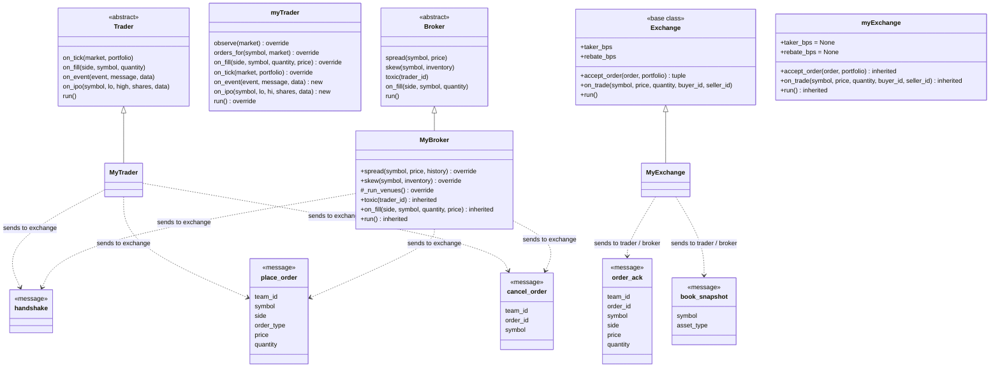

#Phase 0 UML Diagram 

```mermaid 
classDiagram
    class Trader{
        <<abstract>>
        on_tick(market, portfolio)
        on_fill(side, symbol, quantity)
        on_event(event, message, data)
        on_ipo(symbol, lo, high, shares, data)
        run()

    }
    class myTrader{
        observe(market) override
        orders_for(symbol, market) override
        on_fill(side, symbol, quantity, price) override
        on_tick(market, portfolio) override
        on_event(event, message, data) new
        on_ipo(symbol, lo, hi, shares, data) new
        run() override 
    }
    class Broker{
        <<abstract>>
        spread(symbol, price)
        skew(symbol, inventory)
        toxic(trader_id)
        on_fill(side, symbol, quantity)
        run()
    }
    class MyBroker {
        +spread(symbol, price, history) override
        +skew(symbol, inventory) override
        #_run_venues() override
        +toxic(trader_id) inherited
        +on_fill(side, symbol, quantity, price) inherited
        +run() inherited
    }
    class Exchange{
        <<base class>>
        +taker_bps
        +rebate_bps
        +accept_order(order, portfolio) tuple
        +on_trade(symbol, price, quantity, buyer_id, seller_id)
        +run()
    }
    class myExchange{
        +taker_bps = None
        +rebate_bps = None
        +accept_order(order, portfolio) inherited
        +on_trade(symbol, price, quantity, buyer_id, seller_id) inherited
        +run() inherited
    }
    class handshake {
        <<message>>
    }
    class place_order {
        <<message>>
        team_id
        symbol
        side
        order_type
        price
        quantity
    }
    class cancel_order {
        <<message>>
        team_id
        order_id
        symbol
    }
    class order_ack {
        <<message>>
        team_id
        order_id
        symbol
        side
        price
        quantity
    }
    class book_snapshot {
        <<message>>
        symbol
        asset_type
    }

    Trader <|-- MyTrader
    Broker <|-- MyBroker
    Exchange <|-- MyExchange

    MyTrader ..> handshake : sends to exchange
    MyTrader ..> place_order : sends to exchange
    MyTrader ..> cancel_order : sends to exchange
    MyBroker ..> handshake : sends to exchange
    MyBroker ..> place_order : sends to exchange
    MyBroker ..> cancel_order : sends to exchange
    MyExchange ..> order_ack : sends to trader / broker
    MyExchange ..> book_snapshot : sends to trader / broker
```