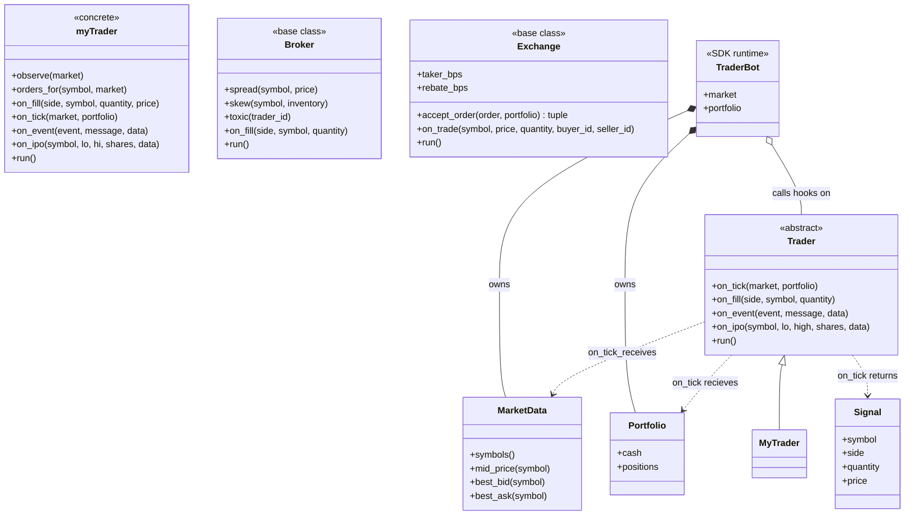

#Phase 0 UML Diagram 

```mermaid 
classDiagram
    direction TB
    class Trader{
        <<abstract>>
        +on_tick(market, portfolio)
        +on_fill(side, symbol, quantity)
        +on_event(event, message, data)
        +on_ipo(symbol, lo, high, shares, data)
        +run()

    }
    class myTrader{
        <<concrete>>
        +observe(market) 
        +orders_for(symbol, market) 
        +on_fill(side, symbol, quantity, price) 
        +on_tick(market, portfolio) 
        +on_event(event, message, data) 
        +on_ipo(symbol, lo, hi, shares, data) 
        +run()  
    }
    class Broker{
        <<base class>>
        +spread(symbol, price)
        +skew(symbol, inventory)
        +toxic(trader_id)
        +on_fill(side, symbol, quantity)
        +run()
    }
    class Exchange{
        <<base class>>
        +taker_bps
        +rebate_bps
        +accept_order(order, portfolio) tuple
        +on_trade(symbol, price, quantity, buyer_id, seller_id)
        +run()
    }
    class TraderBot {
        <<SDK runtime>>
        +market
        +portfolio
    }
    class MarketData {
        +symbols()
        +mid_price(symbol)
        +best_bid(symbol)
        +best_ask(symbol)
    }
    class Portfolio {
        +cash
        +positions
    }
    class Signal {
        +symbol
        +side
        +quantity
        +price
    }
    Trader <|-- MyTrader
    TraderBot *-- MarketData: owns
    TraderBot *-- Portfolio: owns
    TraderBot o-- Trader: calls hooks on 
    Trader ..> MarketData : on_tick_receives
    Trader ..> Portfolio : on_tick recieves
    Trader..> Signal: on_tick returns
```

